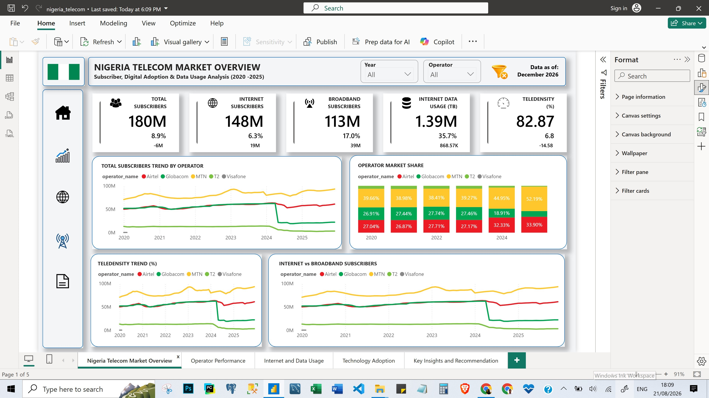
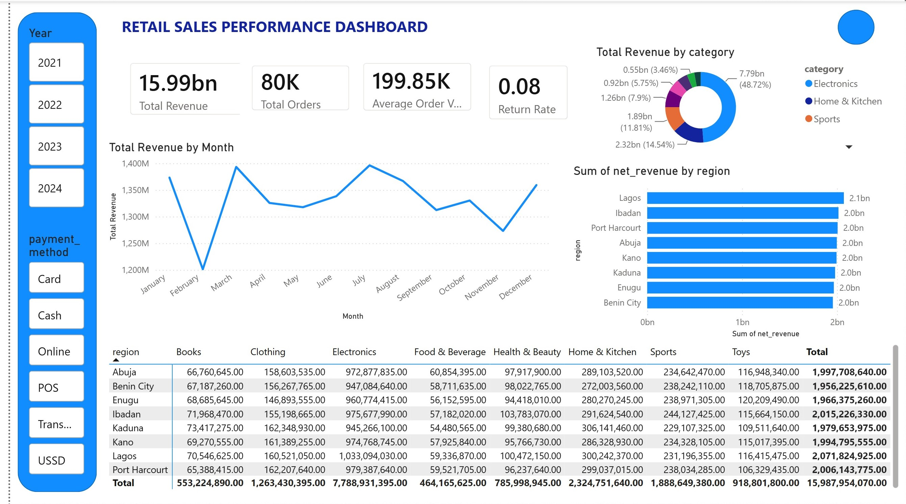

# 📡 Nigeria Telecom Subscriber & Data Usage Trend Analysis


> An end-to-end telecom analytics project using Excel, SQL, and Power BI to analyze subscriber growth, operator market share, digital adoption, and data usage trends across Nigeria's mobile telecom sector, using data sourced from the Nigerian Communications Commission (NCC).**.



---

## 📖 Project Overview

This project analyzes six years of monthly subscriber and usage data (2020–2025) across Nigeria's major GSM mobile operators — MTN, Airtel, Globacom, and 9mobile (T2) — sourced from the Nigerian Communications Commission (NCC).

The objective was to trace subscriber growth, uncover shifts in operator market share, evaluate internet and broadband adoption, and track the technology transition from 2G/3G toward 4G/5G — while surfacing market events that go unnoticed without structured, ongoing analysis.

The project demonstrates a complete analytics workflow — from raw data sourcing and cleaning, through relational database design and querying, to interactive dashboard development.

---

## 🎯 Business Problem

Market shifts in Nigeria's telecom sector — operator gains and losses, technology transitions, adoption surges — often go unnoticed without structured, ongoing analysis.

As a Data Analyst, I was tasked with tracing subscriber and usage trends over time, identifying which operators are gaining or losing ground, evaluating the pace of digital adoption, and explaining anomalies in the data rather than dismissing them as errors.

---

## ❓ Business Questions

This analysis answers the following questions:

This analysis answers the following questions:

1. How has Nigeria's telecom subscriber base changed over time?
2. How has Nigeria's teledensity changed over time?
3. Which operators have the largest subscriber base, and how has their market share changed over time?
4. How has internet and broadband adoption changed over time?
5. How is Nigeria transitioning from 2G/3G toward 4G/5G?
6. How has Nigeria's internet data usage changed over time?

---

## 📂 Dataset

| Attribute | Description |
|-----------|-------------|
| Source | 	Nigerian Communications Commission (NCC) |
| Tables | 	8 (overall subscribers, GSM operator data, GSM reported totals, internet operator data, internet reported totals, broadband penetration, internet usage, technology market share) |
| Period | 2020–2025 |
| Industry | 	Telecommunications |
| Operators Covered | MTN, Airtel, Globacom, 9mobile (T2), plus legacy VITEL/Visafone |
| Country | Nigeria |


---

## 🛠️ Tools & Technologies

| Tool | Purpose |
|------|---------|
| Microsoft Excel & Power Query | Data cleaning, unpivoting, and reshaping |
| MySQL | Relational database design and analysis queries |
| Power BI | Star-schema data modeling and interactive dashboard |


---

## 🔄 Project Workflow

- Data Sourcing (NCC)
- Data Cleaning & Reshaping (Excel / Power Query)
- Relational Database Design (MySQL)
- SQL Analysis Queries
- Power BI Data Modeling (Star Schema)
- Dashboard Development
- Business Insights
- Recommendations

---

## 📊 Dashboard Preview

### Power BI Dashboard



### Dashboard Components

The dashboard consists of 5 pages:

- Nigeria Telecom Overview — national subscriber, teledensity, and adoption trends
- Operator Performance — market share, ranking, and year-by-year operator detail
- Internet & Data Usage — broadband penetration and data consumption trends
- Technology Adoption — 2G/3G/4G/5G network transition
- Key Insights & Recommendations — executive summary and strategic takeaways

---

## 📈 Key Performance Indicators (KPIs) As of December 2025

- **Total Subscribers:** 180M
- **Internet Subscribers:** 148M
- **Broadband Subscribers:** 113M
- **Internet Data Usage:** 1.39M TB
- **Teledensity:** 82.87%

---

## 💡 Key Insights

This analysis uncovered the following insights:

1. Market Concentration: MTN holds 51.9% market share (93M subscribers), up from 39.7% in 2020 — a dramatic consolidation.
2. Operator Divergence: Airtel grew steadily to 33.9% share (61M subscribers, +7.5% YoY), while Globacom fell to 12.4% (22M) and T2 to just 1.8% (3M, -1.7% YoY).
3. 2024 Market Shock: A sharp subscriber drop at Globacom and T2 in 2024 is traced to NCC's NIN-SIM deactivation enforcement, a genuine regulatory market event rather than a data error.
4. Digital Shift: Internet subscribers (148M) represent over 82% of total subscribers, and broadband is growing more than 2x faster than the overall subscriber base.
5. Data Consumption: Internet usage reached 1.39M TB, up 35.7% year-over-year, driven by expanding broadband adoption.
6. Reporting Gaps: Some years show fewer than 6 operators reporting data, a gap that helps explain discrepancies between summed operator totals and NCC's official reported figures.
7. Teledensity Volatility: Teledensity has fluctuated significantly (peaking above 100% before the 2024 decline), reflecting both multi-SIM ownership and the impact of SIM deactivation.

---

## 🚀 Recommendations

Below are the recommendations made from the analysis:

1. For legacy/smaller operators (T2, Globacom): prioritize subscriber win-back and re-linking campaigns following the 2024 deactivation shock.
2. For market leaders (MTN, Airtel): sustain broadband investment, the fastest-growing segment at 17% YoY.
3. For churn reduction: T2 needs targeted data-bundling campaigns to arrest its ongoing decline.
4. For regulators/industry: continue monitoring reporting completeness across operators to reduce reconciliation gaps.
5. Expand technology-generation data collection (2G–5G) into structured monthly tables rather than year-end PDF reports, to support deeper trend analysis.
6. Prioritize infrastructure investment toward regions/segments with the fastest broadband growth to sustain momentum.

---

## 📁 Repository Structure

```text
nigeria-telecom-trend-analysis/
├── data/
│   ├── raw/
│   └── cleaned/
├── excel/
│   └── data_cleaning_workbook.xlsx
├── sql/
│   ├── 01_schema_setup.sql
│   ├── 02_data_import.sql
│   └── 03_analysis_queries.sql
├── powerbi-dashboard/
│   └── nigeria_telecom_dashboard.pbix
├── visuals/
├── docs/
│   ├── excel_documentation.docx
│   ├── sql_documentation.docx
│   └── powerbi_documentation.docx
└── README.md
```

---

## ▶️ How to Reproduce

1. Explore the raw dataset in data/raw/
2. Review the cleaned dataset in data/cleaned/
3. Run the SQL scripts in the sql/ folder using MySQL (in order: schema setup → data import → analysis queries)
4. Open the Power BI dashboard in powerbi-dashboard/
5. Explore the dashboard pages and accompanying documentation in docs/
---

## 👤 Author

**Blessing Usieme**

**Data Analyst - Business Intelligence | Data Visualization and Storytelling**

GitHub: https://github.com/usiemeblessing

LinkedIn: https://linkedin.com/in/blessing-usieme
