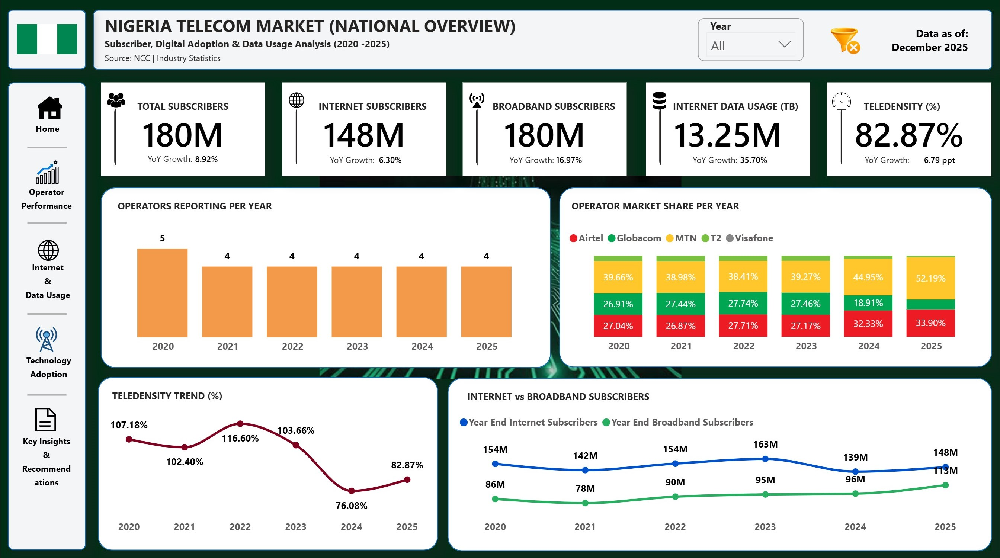
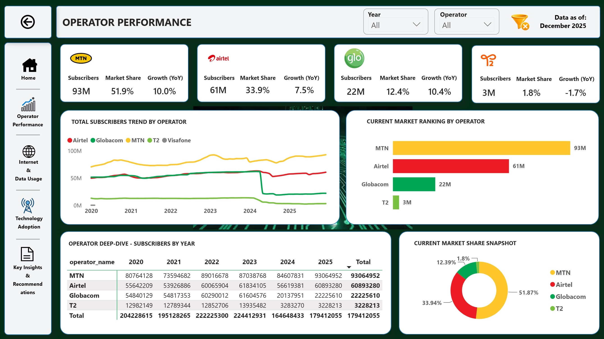
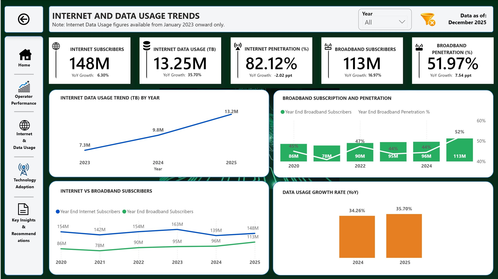
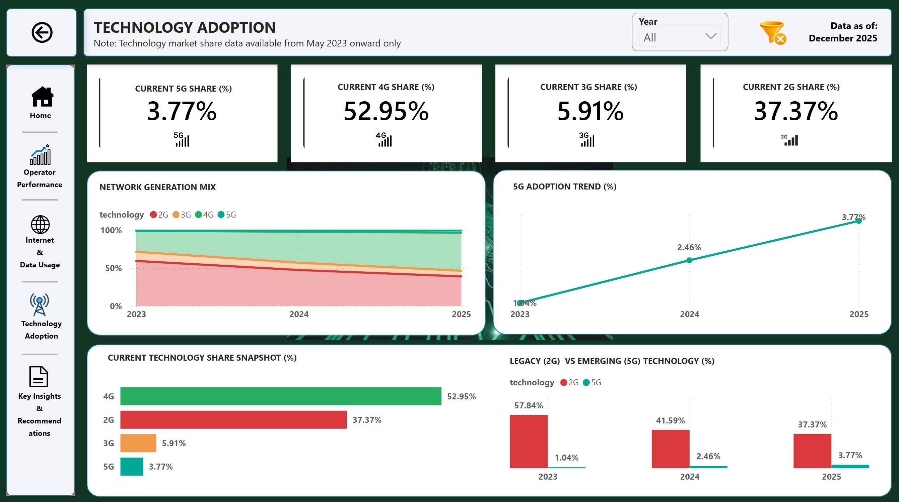
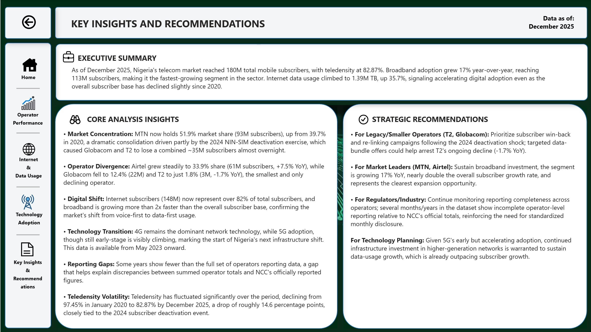

# 📡 Nigeria Telecom Subscriber & Data Usage Trend Analysis


> An end-to-end telecom analytics project using Excel, SQL, and Power BI to analyze subscriber growth, operator market share, digital adoption, and data usage trends across Nigeria's mobile telecom sector, using data sourced from the Nigerian Communications Commission (NCC).**.



---

## 📖 Project Overview

This project analyzes six years of monthly subscriber and usage data (2020–2025) across Nigeria's major GSM mobile operators — MTN, Airtel, Globacom, and 9mobile (T2) — sourced from the Nigerian Communications Commission (NCC).

The objective was to trace subscriber growth, uncover shifts in operator market share, evaluate internet and broadband adoption, and track the technology transition from 2G/3G toward 4G/5G — while surfacing market events that go unnoticed without structured, ongoing analysis.

The project demonstrates a complete analytics workflow — from raw data sourcing and cleaning, through relational database design and querying, to interactive dashboard development.

---

## 🎯 Business Problem

Market shifts in Nigeria's telecom sector — operator gains and losses, technology transitions, adoption surges — often go unnoticed without structured, ongoing analysis.

As a Data Analyst, I was tasked with tracing subscriber and usage trends over time, identifying which operators are gaining or losing ground, evaluating the pace of digital adoption, and explaining anomalies in the data rather than dismissing them as errors.

---

## ❓ Business Questions

This analysis answers the following questions:

This analysis answers the following questions:

1. How has Nigeria's telecom subscriber base changed over time?
2. How has Nigeria's teledensity changed over time?
3. Which operators have the largest subscriber base, and how has their market share changed over time?
4. How has internet and broadband adoption changed over time?
5. How is Nigeria transitioning from 2G/3G toward 4G/5G?
6. How has Nigeria's internet data usage changed over time?

---

## 📂 Dataset

| Attribute | Description |
|-----------|-------------|
| Source | 	Nigerian Communications Commission (NCC) |
| Tables | 	8 (overall subscribers, GSM operator data, GSM reported totals, internet operator data, internet reported totals, broadband penetration, internet usage, technology market share) |
| Period | 2020–2025 |
| Industry | 	Telecommunications |
| Operators Covered | MTN, Airtel, Globacom, 9mobile (T2), plus legacy VITEL/Visafone |
| Country | Nigeria |


---

## 🛠️ Tools & Technologies

| Tool | Purpose |
|------|---------|
| Microsoft Excel & Power Query | Data cleaning, unpivoting, and reshaping |
| MySQL | Relational database design and analysis queries |
| Power BI | Star-schema data modeling and interactive dashboard |


---

## 🔄 Project Workflow

- Data Sourcing (NCC)
- Data Cleaning & Reshaping (Excel / Power Query)
- Relational Database Design (MySQL)
- SQL Analysis Queries
- Power BI Data Modeling (Star Schema)
- Dashboard Development
- Business Insights
- Recommendations

---

## 📊 Dashboard Preview

### Power BI Dashboard (Components)

The dashboard consists of 5 pages:

- Nigeria Telecom Overview — national subscriber, teledensity, and adoption trends

  
- Operator Performance — market share, ranking, and year-by-year operator detail
  
- Internet & Data Usage — broadband penetration and data consumption trends
   
- Technology Adoption — 2G/3G/4G/5G network transition
   
- Key Insights & Recommendations — executive summary and strategic takeaways
   

---

## 📈 Key Performance Indicators (KPIs) As of December 2025

- **Total Subscribers:** 180M
- **Internet Subscribers:** 148M
- **Broadband Subscribers:** 113M
- **Internet Data Usage:** 1.39M TB
- **Teledensity:** 82.87%

---

## 💡 Key Insights

This analysis uncovered the following insights:

• Market Concentration: MTN now holds 51.9% market share (93M subscribers), up from 39.7% in 2020, a dramatic consolidation driven partly by the 2024 NIN-SIM deactivation exercise, which caused Globacom and T2 to lose a combined ~35M subscribers almost overnight.

• Operator Divergence: Airtel grew steadily to 33.9% share (61M subscribers, +7.5% YoY), while Globacom fell to 12.4% (22M) and T2 to just 1.8% (3M, -1.7% YoY), the smallest and only declining operator.

• Digital Shift: Internet subscribers (148M) now represent over 82% of total subscribers, and broadband is growing more than 2x faster than the overall subscriber base, confirming the market's shift from voice-first to data-first usage.

• Technology Transition: 4G remains the dominant network technology, while 5G adoption, though still early-stage is visibly climbing, marking the start of Nigeria's next infrastructure shift. This data is available from May 2023 onward.

• Reporting Gaps: Some years show fewer than the full set of operators reporting data, a gap that helps explain discrepancies between summed operator totals and NCC's officially reported figures.

• Teledensity Volatility: Teledensity has fluctuated significantly over the period, declining from 97.45% in January 2020 to 82.87% by December 2025, a drop of roughly 14.6 percentage points, closely tied to the 2024 subscriber deactivation event.

---

## 🚀 Recommendations

Below are the recommendations made from the analysis:

**• For Legacy/Smaller Operators (T2, Globacom):** Prioritize subscriber win-back and re-linking campaigns following the 2024 deactivation shock; targeted data-bundle offers could help arrest T2's ongoing decline (-1.7% YoY).

• **For Market Leaders (MTN, Airtel):** Sustain broadband investment, the segment is growing 17% YoY, nearly double the overall subscriber growth rate, and represents the clearest expansion opportunity.

• **For Regulators/Industry:** Continue monitoring reporting completeness across operators; several months/years in the dataset show incomplete operator-level reporting relative to NCC's official totals, reinforcing the need for standardized monthly disclosure.

•** For Technology Planning:** Given 5G's early but accelerating adoption, continued infrastructure investment in higher-generation networks is warranted to sustain data-usage growth, which is already outpacing subscriber growth.

---

## 📁 Repository Structure

```text
nigeria-telecom-trend-analysis/
├── 01_ncc_raw_data/
│   └── nigeria_telecom_full_dataset(raw).xlsx
├── 02_cleaned_data_(xlsx, csv)/
    |── broadband_penetration.csv
    |── gsm_internet_subs_operator_data.csv
    |── gsm_internet_subs_reported_total.csv
    |── gsm_subs_operator_data.csv
    |── gsm_subs_reported_total.csv
    |── internet_data_usage.csv
    |── nigeria_telecom_2020_2025_workbook.xlsx
    |── overall_subscribers_.csv
    └── technology_market_share.csv
├── 03_sql/
│   ├── 01_schema_setup.sql
│   ├── 02_data_import.sql
│   └── 03_analysis_queries.sql
├── 04_powerbi-dashboard/
│   └── nigeria_telecom.pbix
├── 05_visuals/
    |── nigeria_telecom_data_model.jpg
    |── page_1_market_overview.jpg
    |── page_2_operator_performance.jpg
    |── page_3_internet_and_data_usage_trend.jpg
    |── page_4_technology_adoption.jpg
    └── page_5_key_insights_and_recommendations.jpg
├── docs/
    ├── excel_documentation.docx
    ├── sql_documentation.docx
    ├── powerbi_documentation.docx
    └── nigeria_telecom_insights_and_recommendations_summary.docx
└── README.md
```

---

## ▶️ How to Reproduce

1. Explore the raw dataset in 01_ncc_raw_data/
2. Review the cleaned datasets in 20_cleaned_data_(xlsx, csv)/
3. Run the SQL scripts in the 03_sql/ folder using MySQL (in order: schema setup → data import → analysis queries)
4. Open the Power BI dashboard in 04_powerbi-dashboard/
5. Explore the dashboard pages in 05_visuals/
6. Explore the accompanying documentation in 06_docs/
---

## 👤 Author

**Blessing Usieme**

**Data Analyst - Business Intelligence | Data Visualization and Storytelling**

GitHub: https://github.com/usiemeblessing

LinkedIn: https://linkedin.com/in/blessing-usieme
